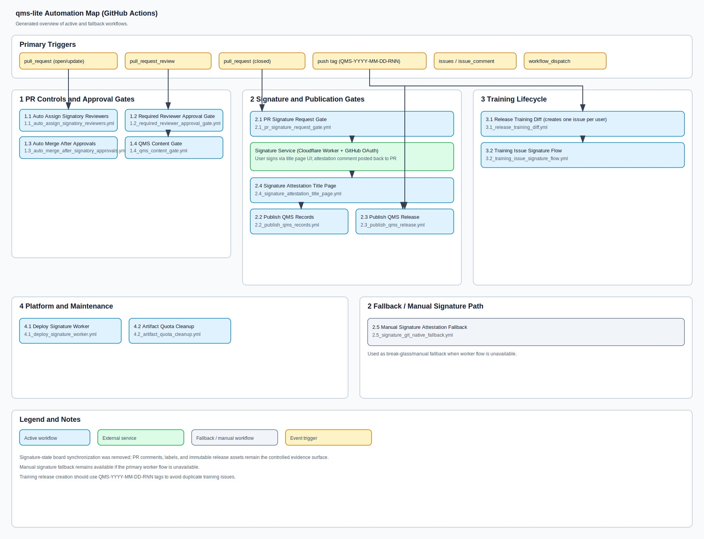

# QMS Lite System Architecture

## 1. Purpose
Describe the QMS Lite operating architecture, with emphasis on:
- GitHub as the primary controlled QMS platform
- automation boundaries and external dependencies
- how issues, pull requests, signatures, releases, and immutable records interact

This document is the system-level architecture description for QMS Lite and complements the process detail in the SOP set.

## 2. Architecture Overview
QMS Lite is a GitHub-native QMS operating model built from:
- controlled content in `sops/`, `matrices/`, `records/`, and `.github/`
- GitHub Issues for planning and coordination
- GitHub Pull Requests for controlled review and approval
- GitHub Actions for enforcement, signing orchestration, training automation, and immutable publication
- GitHub Releases for immutable record and QMS release packaging
- a Cloudflare-hosted signature worker for the primary post-merge signature ceremony
- two separate GitHub identities: a signer-facing OAuth app (`QMS Lite Signature`) and a repository automation app (`qms-lite-bot`)

The canonical controlled reading surface remains GitHub at the approved commit or tag. QMS releases are formalized by tags matching `QMS-YYYY-MM-DD-RNN`.

## 3. Core Components
| Component | Role in the architecture |
|---|---|
| GitHub repository (`qms-lite`) | System of record for QMS procedures, matrices, workflow definitions, and controlled templates. |
| GitHub Issues | Planning and intake layer for CAPA, audit, risk, training, V&V, release, complaint, PMS, and change activities. |
| GitHub Pull Requests | Controlled review, approval, and merge boundary for QMS document and record changes. |
| GitHub Actions | Policy enforcement, reviewer assignment, signature orchestration, training automation, publication, and maintenance jobs. |
| GitHub Releases | Immutable publication surface for quality records and formal QMS release packages. |
| Cloudflare signature worker | External signer UI and OAuth/PIN ceremony for the main Part 11 signing path. |
| `QMS Lite Signature` OAuth app | Signer identity verification during the browser-based signature ceremony. |
| `qms-lite-bot` GitHub App | Repository automation identity for PR comments, merges, release publication, and attestation posting. |
| GitHub Project board | Optional operational board synchronized from signature status labels and actionable work. |
| Signer registry (`matrices/signer_registry.json`) | Source for resolved signatory legal names and job titles in attestation output. |

## 4. Primary Data Flows
1. A QMS activity starts from an issue, a release tag, or a manual workflow dispatch.
2. Controlled changes are implemented on a branch and proposed through a pull request.
3. Guard workflows enforce approval and structural rules on the PR.
4. Once merged, post-merge workflows request signatures, collect attestations, and publish immutable record evidence.
5. Training and attention-board automations derive additional work items from released or merged state.
6. Formal QMS releases package the approved repository state as a GitHub Release on the QMS tag.

## 5. Automation Map
The current workflow topology is summarized in the existing SVG:

Source file: `docs/automation/workflow-automation-map.svg`

## 6. Automation Catalog

### 6.1 PR Controls and Approval Gates
| Workflow | Primary trigger | Purpose | Status |
|---|---|---|---|
| `auto_assign_signatory_reviewers.yml` | `pull_request` | Resolves required signatory reviewers from requested signature roles and assigns them. | Active |
| `required_reviewer_approval_guard.yml` | `pull_request_review` | Enforces at least one valid non-author approval on the current head SHA where required. | Active |
| `auto_merge_after_signatory_approvals.yml` | `pull_request_review` | Enables merge only after assigned reviewer approvals are present. | Active |
| `sop_published_index_guard.yml` | `pull_request` | Blocks SOP PRs when `README.md` published-index content is not updated consistently. | Active |
| `sop_training_matrix_guard.yml` | `pull_request` | Blocks SOP PRs when training impact and role coverage are not updated. | Active |
| `risk_record_schema_guard.yml` | `pull_request` | Validates controlled risk-record YAML structure and scoring consistency. | Active |
| `training_pr_approval_gate.yml` | `pull_request`, `pull_request_review` | Enforces trainee approval for PRs updating designated training records. | Active |
| `qms_record_lock.yml` | `pull_request` | Legacy PDF-lock path that overlaps with immutable release publication behavior. | Legacy / overlap |

### 6.2 Post-Merge Signature and Publication
| Workflow | Primary trigger | Purpose | Status |
|---|---|---|---|
| `issue_pr_part11_gate.yml` | `pull_request` (closed, merged) | Parses PR signature requirements and posts signer-specific links for the signature ceremony. | Active |
| `publish_qms_records.yml` | `pull_request` (closed, merged) | Waits for signatures, packages changed record artifacts, and publishes immutable releases. | Active |
| `signature_status_tracker.yml` | `pull_request`, `issues`, `workflow_dispatch` | Maintains signature-state labels and optionally syncs a GitHub Project board. | Active |
| `part11_attestation_title_page.yml` | `issue_comment` | Supports title-page generation path for attestation packages. | Active support workflow |
| `part11_git_native_signature.yml` | `workflow_dispatch` | Manual / break-glass fallback signature path if the primary worker flow is unavailable. | Fallback |

### 6.3 Training Lifecycle
| Workflow | Primary trigger | Purpose | Status |
|---|---|---|---|
| `release_training_diff.yml` | `push` on QMS release tag, `workflow_dispatch` | Compares required SOP revisions to user training logs and opens one training issue per user. | Active |
| `training_issue_signature_flow.yml` | `issues`, `workflow_dispatch` | Manages signature collection and closure flow for consolidated training issues. | Active |
| `training_issue_legacy_cleanup.yml` | `issues` | Closes obsolete training issue formats and cleans up assignments. | Active |
| `manual_training_onboarding_pr.yml` | `workflow_dispatch` | Creates a review-only onboarding PR from the current SOP baseline. | Active |
| `training_review_signoff.yml` | `pull_request` (closed) | Completes signoff and immutable publication for review-only onboarding PRs. | Active |
| `auto_training_assign.yml` | `workflow_dispatch` | Deprecated manual-only notice path retained for backward compatibility. | Deprecated |

### 6.4 Platform and Maintenance Operations
| Workflow | Primary trigger | Purpose | Status |
|---|---|---|---|
| `deploy_signature_worker.yml` | `workflow_dispatch` | Deploys the Cloudflare signature worker. | Active |
| `artifact_quota_cleanup.yml` | `workflow_dispatch` | Deletes old workflow artifacts to control storage quota. | Active maintenance |

## 7. External Dependencies and Trust Boundaries
| Dependency | Boundary | Purpose |
|---|---|---|
| GitHub-hosted Actions runners | External platform runtime | Execute automation logic, enforce guards, and publish releases. |
| Cloudflare Workers | External service | Hosts the signer-facing ceremony, validates link signatures, and posts attestation comments through `qms-lite-bot`. |
| GitHub OAuth app credentials | Secret-managed integration | Authenticate signer identity during the browser ceremony. |
| GitHub App credentials | Secret-managed integration | Authenticate repository automation such as PR comments, merges, and immutable release publication. |
| Repository secrets and variables | Controlled configuration | Provide signing, deployment, and board-sync configuration. |

## 8. Architecture Principles
- GitHub is the canonical controlled surface for both content and workflow execution.
- PR review on a specific head SHA is the approval boundary before merge.
- Post-merge attestation is the formal electronic signature manifestation step.
- Immutable GitHub Releases are the long-term evidence package for records and QMS releases.
- Manual and fallback workflows exist, but the preferred operating path is the automated GitHub-native flow.
