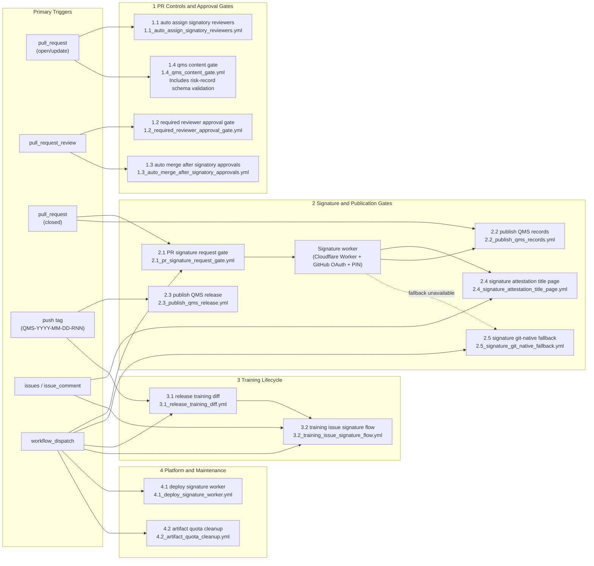

# QMS Lite System Architecture

## 1. TL;DR
- GitHub is the canonical controlled surface for both content and workflow execution.
- `qms-lite` governs the QMS baseline; product/study execution records may live in designated repositories that reuse the same templates and signature model.
- PR review on a specific head SHA is the approval boundary before merge.
- Post-merge attestation is the formal electronic signature manifestation step.
- Immutable GitHub Releases are the long-term evidence package for records and QMS releases.
- Manual and fallback workflows exist, but the preferred operating path is the automated GitHub-native flow.

## 2. What This Document Covers
This document describes how the QMS operates as a system: where controlled content lives, which GitHub Actions enforce policy, how signatures and publication work, and where the external trust boundaries are. Process rules remain in the SOPs and WIs; this document explains the platform behavior around them.

## 3. Architecture Overview
QMS Lite is a GitHub-native QMS operating model built from:
- controlled content in `sops/`, `matrices/`, selected company-level records, reusable templates, and `.github/`
- GitHub Issues for planning and coordination
- GitHub Pull Requests for controlled review and approval
- GitHub Actions for enforcement, signing orchestration, training automation, and immutable publication
- GitHub Releases for immutable record and QMS release packaging
- a Cloudflare-hosted signature worker for the primary post-merge signature ceremony

The canonical controlled reading surface remains GitHub at the approved commit or tag. QMS releases are formalized by tags matching `QMS-YYYY-MM-DD-RNN`.

## 4. Core Components
| Component | Role in the architecture |
|---|---|
| GitHub repository (`qms-lite`) | System of record for QMS procedures, matrices, workflow definitions, reusable templates, and selected company-level records. |
| GitHub Issues | Planning and intake layer for CAPA, audit, risk, training, V&V, release, complaint, PMS, and change activities. |
| GitHub Pull Requests | Controlled review, approval, and merge boundary for QMS document and record changes. |
| GitHub Actions | Policy enforcement, reviewer assignment, signature orchestration, training automation, publication, and maintenance jobs. |
| GitHub Releases | Immutable publication surface for quality records and formal QMS release packages. |
| Cloudflare signature worker | External signer UI and OAuth/PIN ceremony for the primary electronic-signature path. |
| GitHub App token | Required for posting signature-attestation comments back to PRs. |
| Signer registry (`matrices/signer_registry.json`) | Source for resolved signatory legal names and job titles in attestation output. |

## 5. Primary Data Flows
1. A QMS activity starts from an issue, a release tag, or a manual workflow dispatch.
2. Controlled changes are implemented on a branch and proposed through a pull request.
3. Gate workflows enforce approval and structural rules on the PR.
4. Once merged, post-merge workflows request signatures, collect attestations, and publish immutable record evidence for execution records maintained in the target repository.
5. Training automations derive additional work items from released or merged state.
6. Formal QMS releases package the approved repository state as a GitHub Release on the QMS tag.

## 6. Automation Map
The current workflow topology is summarized below.

## 7. Automation Catalog

### 7.1 PR Controls and Approval Gates
| Workflow | Primary trigger | Purpose | Status |
|---|---|---|---|
| `1.1_auto_assign_signatory_reviewers.yml` | `pull_request` | Resolves required signatory reviewers from requested signature roles and assigns them. | Active |
| `1.2_required_reviewer_approval_gate.yml` | `pull_request_review` | Enforces at least one valid non-author approval on the current head SHA where required. | Active |
| `1.3_auto_merge_after_signatory_approvals.yml` | `pull_request_review` | Enables merge only after assigned reviewer approvals are present. | Active |
| `1.4_qms_content_gate.yml` | `pull_request` | Enforces revision-history, README navigation/index, training-matrix synchronization, configured record-index sanity checks, and risk-record schema validation for controlled content changes. | Active |

### 7.2 Signature and Publication Gates
| Workflow | Primary trigger | Purpose | Status |
|---|---|---|---|
| `2.1_pr_signature_request_gate.yml` | `pull_request` (closed, merged) | Parses PR signature requirements and posts signer-specific links for the signature ceremony. | Active |
| `2.2_publish_qms_records.yml` | `pull_request` (closed, merged) | Waits for signatures, packages changed execution record artifacts under `records/`, and publishes immutable releases. | Active |
| `2.3_publish_qms_release.yml` | `push` on QMS release tag | Packages the approved repository state and publishes the formal QMS release bundle. | Active |
| `2.4_signature_attestation_title_page.yml` | `issue_comment` | Supports signature-certificate generation for attestation packages. | Active support workflow |
| `2.5_signature_git_native_fallback.yml` | `workflow_dispatch` | Manual / break-glass fallback signature path if the primary worker flow is unavailable. | Fallback |

### 7.3 Training Lifecycle
| Workflow | Primary trigger | Purpose | Status |
|---|---|---|---|
| `3.1_release_training_diff.yml` | `push` on QMS release tag, `workflow_dispatch` | Compares required SOP revisions to user training logs and opens one consolidated training issue per user. | Active |
| `3.2_training_issue_signature_flow.yml` | `issues`, `workflow_dispatch` | Manages signature collection and closure flow for consolidated training issues. | Active |

### 7.4 Platform and Maintenance Operations
| Workflow | Primary trigger | Purpose | Status |
|---|---|---|---|
| `4.1_deploy_signature_worker.yml` | `workflow_dispatch` | Deploys the Cloudflare signature worker. | Active |
| `4.2_artifact_quota_cleanup.yml` | `workflow_dispatch` | Deletes old workflow artifacts to control storage quota. | Active maintenance |

## 8. External Dependencies and Trust Boundaries
| Dependency | Boundary | Purpose |
|---|---|---|
| GitHub-hosted Actions runners | External platform runtime | Execute automation logic, enforce gates, and publish releases. |
| Cloudflare Workers | External service | Hosts the signer-facing ceremony, validates link signatures, and posts attestation comments through the GitHub App. |
| GitHub App credentials | Secret-managed integration | Authenticates PR-comment posting for signature requests and attestations. |
| Repository secrets and variables | Controlled configuration | Provide signing and deployment configuration. |
