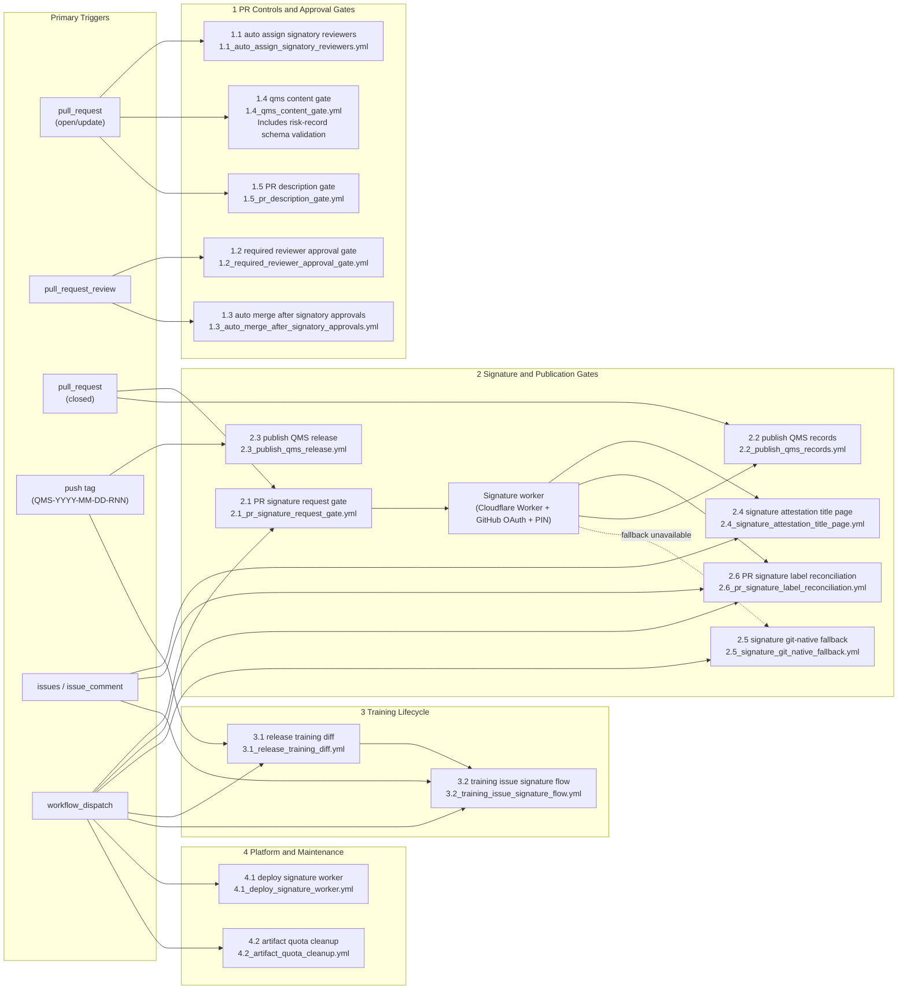

# DearAuditor Open QMS Baseline System Architecture

## 1. TL;DR
- GitHub is the canonical controlled surface for both content and workflow execution.
- this upstream baseline repository governs the QMS baseline; product/study execution records may live in designated repositories that reuse the same templates and signature model.
- PR review on a specific head SHA is the approval boundary before merge.
- Post-merge attestation is the formal electronic signature manifestation step.
- Immutable GitHub Releases are the long-term evidence package for records and QMS releases.
- Manual and fallback workflows exist, but the preferred operating path is the automated GitHub-native flow.

## 2. What This Document Covers
This document describes how the QMS operates as a system: where controlled content lives, which GitHub Actions enforce policy, how signatures and publication work, and where the external trust boundaries are. Process rules remain in the SOPs and WIs; this document explains the platform behavior around them.

## 3. Architecture Overview
DearAuditor Open QMS Baseline is a GitHub-native QMS operating model built from:
- controlled content in `qm/`, `sops/`, `matrices/`, selected company-level records, reusable templates, and `.github/`
- GitHub Issues for planning and coordination
- GitHub Pull Requests for controlled review and approval
- GitHub Actions for policy evaluation, signing orchestration, training automation, and immutable publication
- GitHub Releases for immutable record and QMS release packaging
- a Cloudflare-hosted signature worker for the primary post-merge signature ceremony

The canonical controlled reading surface remains GitHub at the approved commit or tag. QMS releases are formalized by tags matching `QMS-YYYY-MM-DD-RNN`.

For open-source distribution, this repository acts as the public upstream baseline. Adopting companies are expected to bootstrap a private repository from a selected upstream baseline ref and then pull later upstream changes through explicit upgrade PRs. The sync boundary is defined in [`distribution-map.json`](../../distribution-map.json), and the operational entry points are documented in [`../open-source/README.md`](../open-source/README.md).

## 4. Core Components
| Component | Role in the architecture |
|---|---|
| GitHub repository (`AliakseiT/dearauditor-qms-baseline`) | System of record for QMS procedures, matrices, workflow definitions, reusable templates, and selected company-level records. |
| `distribution-map.json` + `tools/` | Defines which paths remain upstream-owned, which files are bootstrapped as company-owned, and which repo settings must exist in downstream adopters. |
| GitHub Issues | Planning and intake layer for CAPA, audit, risk, training, V&V, release, complaint, PMS, and change activities. |
| GitHub Pull Requests | Controlled review, approval, and merge boundary for QMS document and record changes. |
| GitHub Actions | Policy evaluation, reviewer assignment, signature orchestration, training automation, publication, and maintenance jobs. |
| GitHub Releases | Immutable publication surface for quality records and formal QMS release packages. |
| Cloudflare signature worker | External signer UI and OAuth/PIN ceremony for the primary electronic-signature path. |
| GitHub App token | Required for signature-attestation comments, PR automation, and merges, including PRs that modify workflow files. |
| Signer registry (`matrices/signer_registry.json`) | Source for resolved signatory legal names and job titles in attestation output. |

## 5. Primary Data Flows
1. A QMS activity starts from an issue, a release tag, or a manual workflow dispatch.
2. Controlled changes are implemented on a branch and proposed through a pull request.
3. Gate workflows evaluate approval and structural rules on the PR and can drive auto-merge behavior where repository settings allow enforcement.
4. Once merged, post-merge workflows request signatures, maintain PR signature-status labels, collect attestations, and publish immutable record evidence for execution records maintained in the target repository.
5. Training automations derive additional work items from released or merged state.
6. Formal QMS releases package the approved repository state as a GitHub Release on the QMS tag.

For private adopter repos, the additional operating flow is:

7. A company bootstraps a private adopter repo from a selected upstream baseline ref using `tools/bootstrap_company_repo.sh`.
8. Company-owned matrices and operational records are tailored locally and validated before first use.
9. Later upstream changes are proposed into the adopter repo by `tools/open_upstream_upgrade_pr.sh`, which updates only upstream-owned paths and records the proposed baseline in `adoption/upstream-baseline.json`.

## 6. Automation Map
The current workflow topology is summarized below.

## 7. Automation Catalog

### 7.1 PR Controls and Approval Gates
| Workflow | Primary trigger | Purpose | Status |
|---|---|---|---|
| `1.1_auto_assign_signatory_reviewers.yml` | `pull_request` | Resolves required signatory reviewers from requested signature roles and assigns them. | Active |
| `1.2_required_reviewer_approval_gate.yml` | `pull_request_review` | Validates that at least one required non-author approval exists on the current head SHA. | Active |
| `1.3_auto_merge_after_signatory_approvals.yml` | `pull_request_review` | Enables auto-merge after assigned reviewer approvals are present; repository-level branch protection or rulesets are still required to hard-block manual merges. | Active |
| `1.4_qms_content_gate.yml` | `pull_request` | Validates revision-history, README navigation/index, training-matrix synchronization, configured record-index sanity checks, and risk-record schema validation for controlled content changes. | Active |
| `1.5_pr_description_gate.yml` | `pull_request` | Validates that the PR body contains structural headers for `Summary`, `Why` (or `Context`), and `Validation` (or `Testing`). | Active |

### 7.2 Signature and Publication Gates
| Workflow | Primary trigger | Purpose | Status |
|---|---|---|---|
| `2.1_pr_signature_request_gate.yml` | `pull_request` (closed, merged) | Parses PR signature requirements and posts or refreshes signer-specific links for the signature ceremony. | Active |
| `2.6_pr_signature_label_reconciliation.yml` | `issue_comment`, `workflow_dispatch` | Reconciles `signature/outstanding` / `signature/complete` on merged PRs based on the latest signature request comment and collected attestations. It also removes legacy plural label variants from PRs. | Active |
| `2.2_publish_qms_records.yml` | `pull_request` (closed, merged) | Waits for signatures, packages changed execution record artifacts under `records/`, groups risk/usability bundles where required, and publishes immutable releases. | Active |
| `2.3_publish_qms_release.yml` | `push` on QMS release tag | Packages the approved repository state and publishes the formal QMS release bundle. | Active |
| `2.4_signature_attestation_title_page.yml` | `issue_comment` | Supports signature-certificate generation for attestation packages. | Active support workflow |
| `2.5_signature_git_native_fallback.yml` | `workflow_dispatch` | Manual / break-glass fallback signature path if the primary worker flow is unavailable. | Fallback |

### 7.3 Training Lifecycle
| Workflow | Primary trigger | Purpose | Status |
|---|---|---|---|
| `3.1_release_training_diff.yml` | `push` on QMS release tag, `workflow_dispatch` | Compares required controlled-document revisions to the current training status register and opens one consolidated training issue per user. | Active |
| `3.2_training_issue_signature_flow.yml` | `issues`, `issue_comment`, `workflow_dispatch` | Manages signature collection and closure flow for consolidated training issues, including attestation-comment reconciliation and automatic closure. | Active |
| `3.3_refresh_training_status_pr.yml` | `workflow_dispatch` | Exports training issue evidence, rebuilds the generated training status artifacts, opens or updates a PR when those generated files change, and maintains a visible failure notice for manual retry. | Active |

### 7.4 Platform and Maintenance Operations
| Workflow | Primary trigger | Purpose | Status |
|---|---|---|---|
| `4.1_deploy_signature_worker.yml` | `workflow_dispatch` | Deploys the Cloudflare signature worker. | Active |
| `4.2_artifact_quota_cleanup.yml` | `workflow_dispatch` | Deletes old workflow artifacts to control storage quota. | Active maintenance |

## 8. External Dependencies and Trust Boundaries
| Dependency | Boundary | Purpose |
|---|---|---|
| GitHub-hosted Actions runner | External platform runtime | Execute automation logic, evaluate configured gates, and publish releases. |
| Cloudflare Workers | External service | Hosts the signer-facing ceremony, validates link signatures, and posts attestation comments through the GitHub App. |
| GitHub App credentials | Secret-managed integration | Authenticates PR-comment posting for signature requests and attestations. |
| Repository secrets and variables | Controlled configuration | Provide signing and deployment configuration. |

PR signature-status labels are part of the operating model:

- `signature/outstanding` means the merged PR has an active signature request and is still awaiting the required attestations.
- `signature/complete` means the latest active signature request has enough valid attestations for that PR/hash/meaning combination.

## 9. Tag Namespaces

High-volume immutable publication tags and downstream-adoptable baseline tags must remain separate.

- `QMS-*` is the formal upstream baseline namespace and the only namespace intended for downstream adoption by default.
- `QMSPREVIEW-*` is reserved for immutable candidate baselines when a stable preview is needed.
- record/signature tags such as `sig-*`, `record-*`, and `trn-*` are evidence-retention tags and are intentionally ignored by downstream upgrade tooling.

This separation allows the repository to keep thousands of immutable publication tags without turning them into downstream upgrade inputs.

## 10. Platform Caveat
On private repositories using GitHub Free, GitHub does not provide branch protection or rulesets to hard-block merges. In that deployment model, DearAuditor Open QMS Baseline workflows can validate approvals and avoid enabling auto-merge, but an accidental manual merge without the intended approvals remains technically possible.
