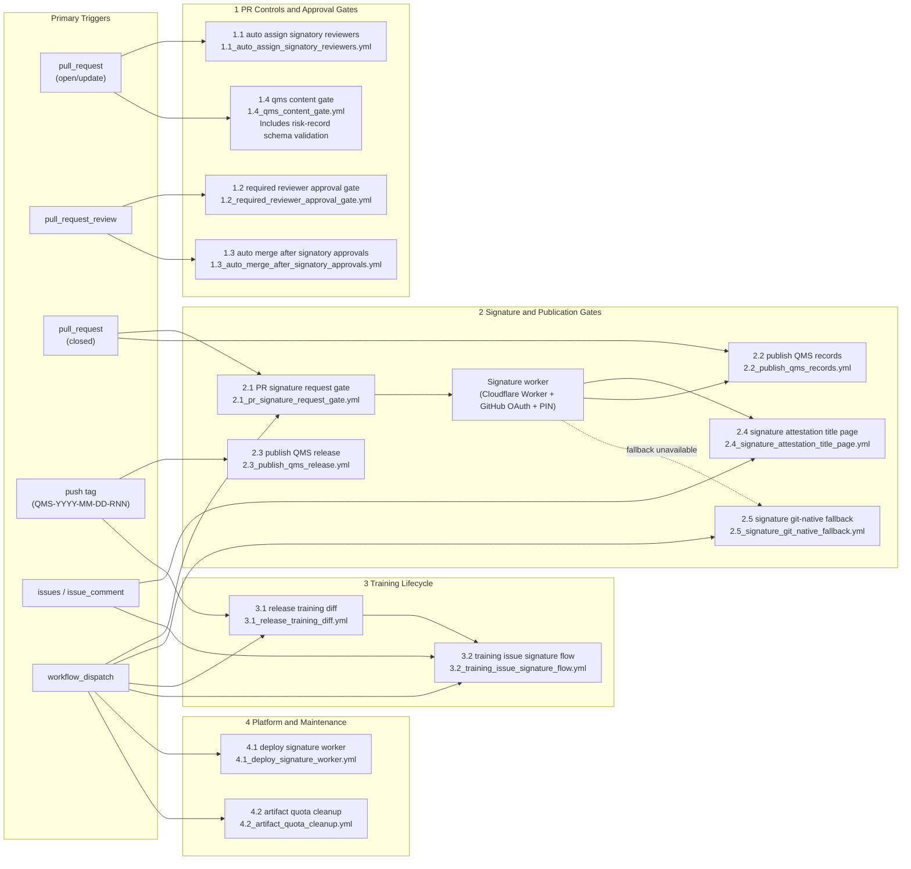

# Workflow Automation Map

This is the text-native source of truth for the QMS Lite automation topology. GitHub renders the Mermaid diagram directly, so the map stays readable in pull requests and easier to maintain than a hand-edited SVG.

## Notes

- `1.4_qms_content_gate.yml` is the consolidated content sanity check. It covers README/index synchronization, training-matrix synchronization, configured record-index checks, and risk-register schema validation.
- Training now uses a single issue-based path: `3.1` creates consolidated per-user training issues and `3.2` manages their signature and closure flow.
- The manual signature fallback remains available only as a break-glass path if the primary signature worker flow is unavailable.
